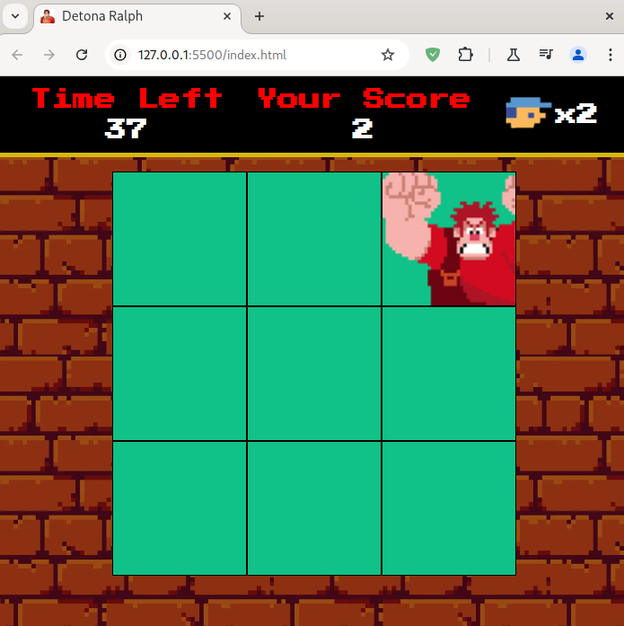

<h1>
    <a href="https://www.dio.me/">
     </a>
    <span> Ri Happy - Front-end do Zero
</span>
</h1>

# :computer: Desafio de projeto: Criando um Jogo do Detona Ralph com JavaScript

## Objetivo do desafio:

Sua missão vai ser reproduzir passo passo o projeto visto nessa aula, ao final
suba seu projeto no Github e compartilhe conosco clicando no botão "Entregar Projeto" e cole o link do seu repositório do Github.

[github do instrutor](https://github.com/digitalinnovationone/jsgame-detona-ralph)


# :bulb: Solução do desafio 

O jogo Detona Ralph foi reproduzido seguindo a aula do instrutor.

<p>

</p>

## Modificações no projeto

Adicionei um ícone ao título da página em **index.html**:
```html
<title>Detona Ralph</title>
    <link rel="icon" type="image/x-icon" href="./src/images/favicon.jpg">
```

Adicionei uma função para diminuir a vida quando clicar no quadrado errado em **./src/scripts/engine.js**:

```js
function decreaseLife(){
    state.values.currentLife--;
    state.view.lives.textContent = 'x' + state.values.currentLife;
    if(state.values.currentLife <= 0){
        if(confirm("Game Over. Your Score: " + state.values.result)){
            window.location.reload();  
        }
    }
}
```

Troquei a função alert() por confirm() para recarregar a página e reiniciar o jogo após fechar a mensagem.

Adicionei o arquivo de audio **./src/audios/miss.m4a** para quando o click do mouse é no quadrado errado.

O arquivo foi baixado [do site mixkit](https://mixkit.co/free-sound-effects/game/) e convertido usando o FAAC (Freeware Advanced Audio Coder) no linux:

```console
$ faac originalfile.wav -o outputfile.m4a
```