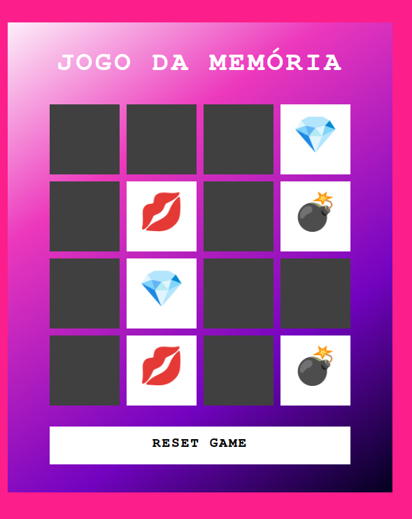

<h1>
    
     Ri Happy - Front-end do Zero

</h1>

# :computer: Desafio de projeto: Criando um Jogo da memória com Emojis Utilizando Javascript

Chegou a hora de colocar em prática tudo aquilo que você aprendeu durante esse projeto.

👨‍💻 OBJETIVO:
Sua missão vai ser reproduzir passo passo o projeto visto nessa aula, ao final
suba seu projeto no Github e compartilhe conosco clicando no botão "Entregar Projeto" e cole o link do seu repositório do Github.

[Github do instrutor](https://github.com/digitalinnovationone/js-emoji-memory-game)

# :bulb: Solução do desafio 

O jogo da memória foi reproduzido codando durante a aula do instrutor.

