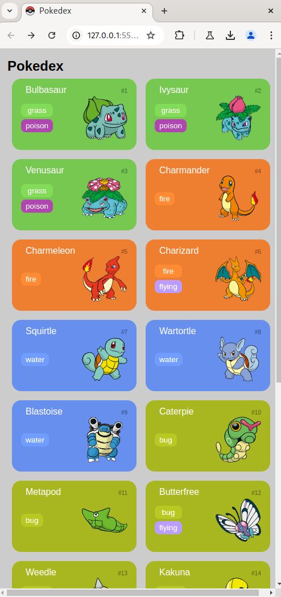
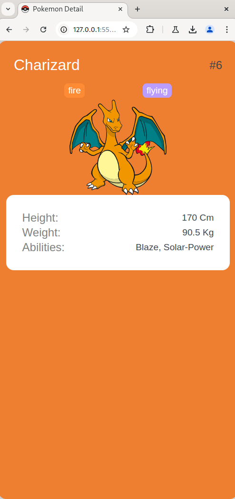

<h1>
    <a href="https://www.dio.me/">
     </a>
    <span> Ri Happy - Front-end do Zero
</span>
</h1>

# :computer: Desafio de projeto: Construindo uma Pokédex com JavaScript

Entenda a importância do Git/GitHub nos Desafios de Projeto da DIO, além de explorar o mundo Pokémon através do consumo de uma API REST para a criação de uma Pokédex incrível! Para isso, você irá explorar, além do JavaScript, todos os fundamentos de desenvolvimento Web aprendidos até aqui.

Todo código-fonte desenvolvido para este conteúdo foi versionado no [GitHub do instrutor](https://github.com/digitalinnovationone/js-developer-pokedex)


# :bulb: Solução do desafio 

A listagem de pokemons foi feita seguindo as aulas do instrutor. 

Adicionei uma imagem como favicon no head das duas páginas: `index.html` e `detail.html`

```html
    <link rel="icon" type="image/x-icon" href="./src/pokeicon.png">
```
<p align=center>

</p>

Como modificação adicional do projeto, criei a página `detail.html` que mostra os detalhes quando se clica em um pokemon.

<p align=center>

</p>

Modifiquei a função no arquivo `/src/scripts/main.js` 

```javascript
function convertPokemonToLi(pokemon) {
    return `
        <li class="pokemon ${pokemon.type}" onclick="clickToDetail(this.querySelector('.number').innerText)">
            <span class="number">#${pokemon.number}</span>
            <span class="name">${pokemon.name}</span>
            <div class="detail">
                <ol class="types">
                    ${pokemon.types.map((type) => `<li class="type ${type}">${type}</li>`).join('')}
                </ol>
                
            </div>
        </li>
    `
}
```

Em que adicionei

```javascript
onclick="clickToDetail(this.querySelector('.number').innerText)
```

Para fazer o evento quando clicar no pokemon e receber o texto que está em `.number`para pegarmos o `id` do pokemon.

Então defini a função que abre a página `detail.html` passando o id como variável na URL.
```javascript
function clickToDetail(number) {
    console.log(number.slice(1))
    window.location = "http://127.0.0.1:5500/detail.html?id="+number.slice(1)
}
```

Já no arquivo `pokemon-model.js`, adicionei a classe para convertermos a informação da API

```javascript
class AboutPokemon{
    name;
    type;
    types = [];
    photo;
    abilities = [];
    height;
    weight;
}
```

Em `detail.html` temos a página base para detalharmos o pokemon. Toda o conteúdo de `section` é substituído com o script em `/src/scripts/poke-about.js` com os dados da pokeAPI.