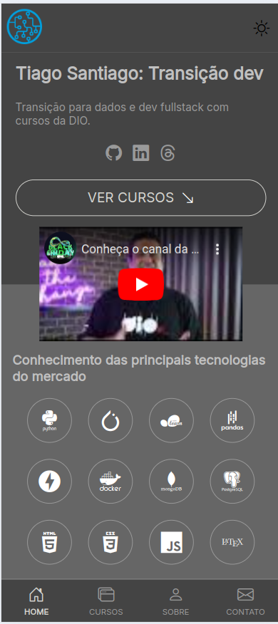
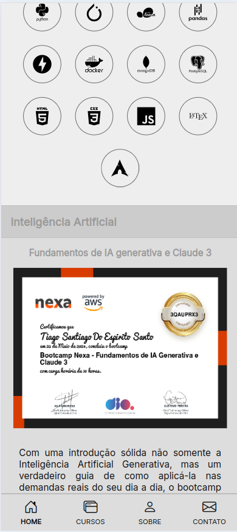

<h1>
<a href="https://www.dio.me/">
     </a>
    <span> Ri Happy - Front-end do Zero</span>
</h1>

# :computer: Desafio de projeto: Construindo seu Portfólio Front-end do Zero com HTML, CSS e JavaScript

Agora é a sua hora de brilhar e construir um perfil de destaque na DIO! Explore todos os conceitos explorados até aqui e replique (ou melhore, porque não?) este projeto prático. Para isso, crie seu próprio repositório e aumente ainda mais seu portfólio de projetos no GitHub, o qual pode fazer toda diferença em suas entrevistas técnicas 😎
 
[Github instrutor](https://github.com/elidianaandrade/dio-lab-portfolio)

# :bulb: Solução do desafio

Foi feito um layout de portfólio responsivo (mobile e desktop) em que apresento alguns certificados de cursos que fiz durante minha jornada na DIO. 

Estrutura do projeto:

```console
PortfolioTransicao/
├── assets
│   ├── data
│   │   └── courses.json
│   ├── images
│   ├── scripts
│   │   └── scripts.js
│   └── styles
│       ├── global.css
│       ├── reset.css
│       └── styles.css
└── index.html
```

Há dois temas, *dark* e *light*, definidos no arquivo `global.css`. Os cursos são adicionados dinamicamente com JS `scripts.js` em que os dados são importados do arquivo `courses.json`. 

A cor de fundo e o alinhamento reverso do certificado e descrição na versão desktop são controladas dinamicamente por meio de um booleano (`counter % 2`)  de um contador que armazena quantos cursos foram adicionados.

```javascript
fetch('/assets/data/courses.json')
    .then(response => response.json())
    .then((json) => {
        for (const [key, value] of Object.entries(json['courses_types'])) {
            document.querySelector('.courses').innerHTML += addCoursesSection(key, value)
            for (let i = 0; i < json[key].length; i++) {
                document.querySelector(`.${key}`).innerHTML += addCourse(json[key][i], counter % 2)
                counter++;
            } 
        }
    })
```

As páginas Sobre e Contatos não foram adicionadas e ficam para um projeto futuro.

## Mobile

Preview do layout mobile
<p>


</p>

## Desktop

<p>

</p>


## Links úteis
* Download logo
    * https://www.pngwing.com/pt/free-png-vddvt

* Gerar favicon
    * https://favicon.io/favicon-converter/

* Ícones bootstrap
    * https://icons.getbootstrap.com/

* Ícones de tecnologias
    * https://devicon.dev/
