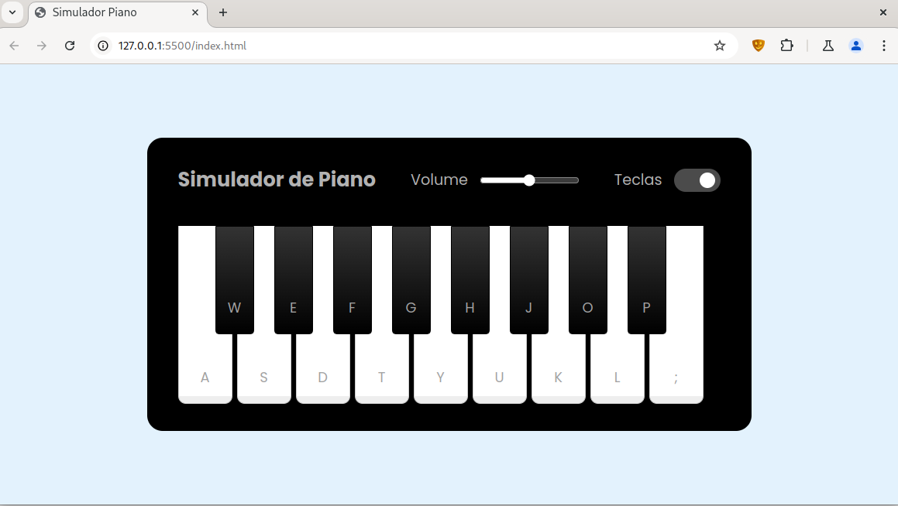

<h1>
<a href="https://www.dio.me/">
     </a>
    <span> Ri Happy - Front-end do Zero</span>
</h1>

# :computer: Desafio de projeto: Construindo um Simulador de Piano com JavaScript e CSS

Sua missão vai ser reproduzir passo passo o projeto visto nessa aula, ao final
suba seu projeto no Github e compartilhe conosco clicando no botão "Entregar Projeto" e cole o link do seu repositório do Github.

🔗 Links Úteis

Código-fonte deste Desafio de Projeto: [Github instrutor](https://github.com/felipeAguiarCode/js-music-keyboard-virtual)

# :bulb: Solução do desafio 

Nesse projeto um simulador de piano virtual foi desenvolvido usando HTML, CSS e JavaScript. As teclas do piano são mapeadas em teclas do teclado.



Estrutura do projeto:

```console
├── index.html
└── src
    ├── scripts
    │   └── engine.js
    ├── styles
    │   ├── main.css
    │   └── reset.css
    └── tunes
```

No diretório `tunes` estão os arquivos de audio.


Foram utilizados conceitos como pseudo-elementos com o CSS:
```CSS

.keys-check input::before {
    content: '';
    height: 20px;
    width: 20px;
    background-color: #8c8c8c;
    top: 50%;
    left: 0.3rem;
    border-radius: inherit;
    position: absolute;
    transform: translateY(-50%);
    transition: all 0.3s ease;
}
```

A propriedade dataset no HTML:
```html
<li class="key white" data-key="a"><span>a</span></li>
```
E manipulacão dinâmica de elementos do html com javascript:

```javascript
keysCheck.addEventListener("click", () => {
    pianoKeys.forEach((key) => {
        key.classList.toggle("hide");
    });
});

```
