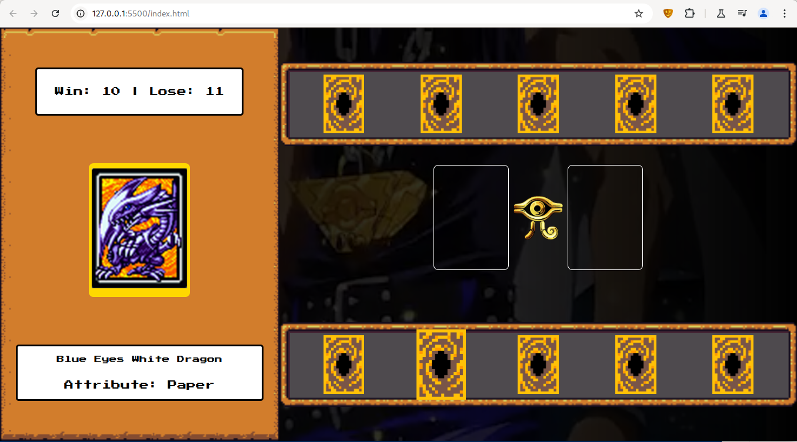

<h1>
    
     Ri Happy - Front-end do Zero

</h1>

# :computer: Desafio de projeto: Criando um Jogo de Cartas do Yu-Gi-Oh! com JavaScript e CSS

Sua missão vai ser reproduzir passo passo o projeto visto nessa aula, ao final
suba seu projeto no Github e compartilhe conosco clicando no botão "Entregar Projeto" e cole o link do seu repositório do Github.

🔗 Links Úteis

Arquivos base do projeto no [github do instrutor](https://github.com/digitalinnovationone/js-yugioh-assets)

# :bulb: Solução do desafio 

O jogo de cartas de Yu-Gi-Oh com as regras de jokenpô foi reproduzido seguindo a aula do instrutor.

